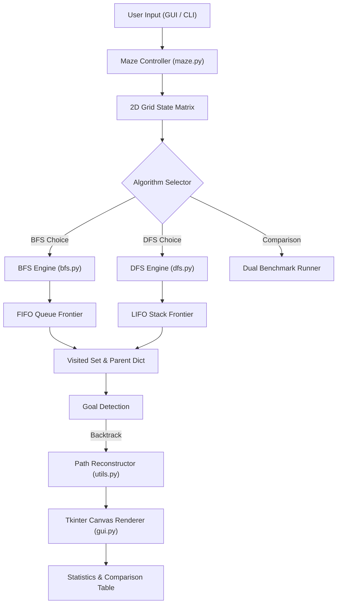
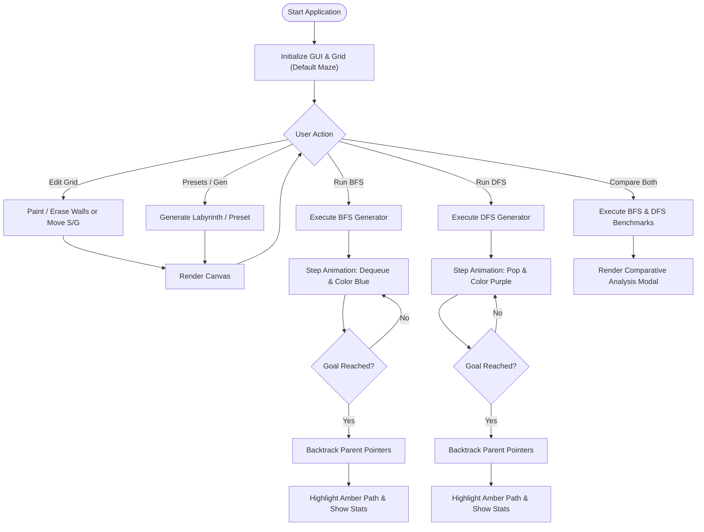
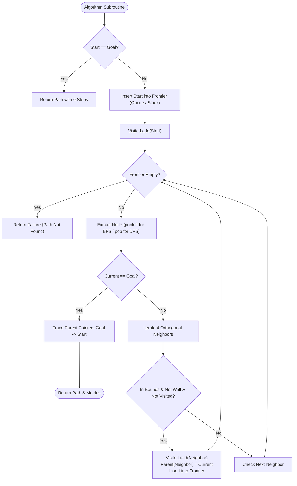

# ACADEMIC MINI PROJECT REPORT

## AI-Based Maze Solver Using Breadth-First Search and Depth-First Search

**Course / Subject:** Foundations of Artificial Intelligence  
**Domain:** Artificial Intelligence & Search Algorithms  
**Target Degree:** Bachelor of Technology (B.Tech) / Bachelor of Engineering (B.E.) in Computer Science & Engineering  
**Technology Stack:** Python 3 (Standard Library), Tkinter GUI  

---

## TABLE OF CONTENTS
1. [Abstract](#1-abstract)
2. [Introduction](#2-introduction)
3. [Problem Statement](#3-problem-statement)
4. [Existing System](#4-existing-system)
5. [Proposed System](#5-proposed-system)
6. [Objectives](#6-objectives)
7. [Scope](#7-scope)
8. [Technologies Used](#8-technologies-used)
9. [System Requirements](#9-system-requirements)
10. [System Architecture](#10-system-architecture)
11. [Algorithm Description](#11-algorithm-description)
12. [BFS Algorithm](#12-bfs-algorithm)
13. [DFS Algorithm](#13-dfs-algorithm)
14. [BFS Pseudocode](#14-bfs-pseudocode)
15. [DFS Pseudocode](#15-dfs-pseudocode)
16. [Flowcharts](#16-flowcharts)
17. [Data Structures Used](#17-data-structures-used)
18. [Module Description](#18-module-description)
19. [Implementation](#19-implementation)
20. [Test Cases](#20-test-cases)
21. [Sample Results](#21-sample-results)
22. [BFS vs DFS Comparison](#22-bfs-vs-dfs-comparison)
23. [Advantages](#23-advantages)
24. [Limitations](#24-limitations)
25. [Applications](#25-applications)
26. [Future Enhancement](#26-future-enhancement)
27. [Conclusion](#27-conclusion)
28. [References](#28-references)

---

## 1. Abstract
The field of Artificial Intelligence (AI) frequently addresses problem-solving agents whose fundamental task is to formulate a sequence of actions that transition a system from an initial state to a predetermined goal state. In classical AI curricula, path-finding across a grid-based maze serves as a cornerstone model for studying search strategies. This academic mini project presents the design, mathematical modeling, implementation, and visual analysis of an **AI-Based Maze Solver Using Breadth-First Search (BFS) and Depth-First Search (DFS)**. 

Built in pure Python with a native Tkinter Graphical User Interface (GUI), the system allows users to construct, edit, randomize, and solve arbitrary 2D grid mazes. Through live step-by-step animations, the software visually highlights the mechanical divergence between FIFO Queue-driven exploration (BFS) and LIFO Stack-driven exploration (DFS). Quantitative benchmarking dynamically calculates path length, nodes expanded, memory frontier size, and CPU execution time, demonstrating empirically why BFS guarantees the shortest path in unweighted graphs whereas DFS may find convoluted, non-optimal detours.

---

## 2. Introduction
Search algorithms form the operational backbone of autonomous agents in Artificial Intelligence. When an agent lacks prior domain-specific heuristic knowledge about the distance to the goal, it must resort to **uninformed search strategies** (also termed blind search). Among uninformed techniques, **Breadth-First Search (BFS)** and **Depth-First Search (DFS)** represent the two foundational paradigms of graph and tree traversal.

A maze can be formally structured as a discrete state space where each open coordinate represents a state, and passable movements between adjacent cells represent valid state transitions. Solving a maze corresponds to discovering an uninterrupted transition sequence connecting the Initial State (Start) to the Terminal State (Goal). Although theoretical proofs confirm that BFS yields shortest paths and DFS conserves branch memory, undergraduate students frequently struggle to visualize their runtime state transformations. This project Bridges theory and practice by offering an interactive software simulation that makes abstract algorithmic properties tangible.

---

## 3. Problem Statement
Given a discrete 2-dimensional grid $M$ of dimensions $R \times C$, partitioned into passable cells (empty pathways) and impassable cells (walls):
- Let $S \in M$ denote the designated Start cell.
- Let $G \in M$ denote the designated Goal cell.
- Transitions are strictly constrained to orthogonal cardinal directions: $\{\text{Up}, \text{Right}, \text{Down}, \text{Left}\}$, with unit cost $c = 1$ per step. Diagonal movement and penetration through wall barriers are prohibited.

The objective is to formulate an intelligent software agent capable of:
1. Determining whether a continuous pathway exists between $S$ and $G$.
2. Finding and reconstructing the explicit path sequence $P = \langle S, v_1, v_2, \dots, G \rangle$.
3. Animating the exploration front of BFS and DFS in real-time.
4. Comparing both algorithms quantitatively across standardized metrics: Path Optimality, Visited Node Count, Memory Overhead, and Computational Latency.

---

## 4. Existing System
Traditionally, search algorithms are introduced in academic textbooks through static diagrams, mathematical pseudocode, and simple terminal print statements.
### Drawbacks of the Existing System:
1. **Lack of Visual Intuition:** Text output (such as coordinate dumps) fails to demonstrate how frontiers expand across branches.
2. **Abstract Understanding of Backtracking:** Students find it difficult to understand why DFS backtracks upon encountering a dead-end without an active animation.
3. **No Direct Experimental Benchmark:** Without an interactive sandbox to test custom wall arrangements, students cannot observe edge cases, such as trapped goals or bifurcated labyrinths.

---

## 5. Proposed System
The proposed system implements a comprehensive, graphical simulation testbed developed using Python 3 and Tkinter.
### Key Features:
- **Interactive Maze Canvas:** Allows arbitrary maze editing via mouse clicks (drawing walls, erasing walls, dragging start and goal nodes).
- **Automated Procedural Generators:** Incorporates Randomized DFS (Recursive Backtracker) for generating authentic labyrinths and random obstacle scattering.
- **Side-by-Side Algorithmic Visualizer:** Distinct color codes for BFS exploration (Sky Blue) and DFS exploration (Amethyst Purple), with real-time frontier counters.
- **Reconstruction Highlighting:** Animated illumination of the final solution path (Radiant Amber) using parent pointer backtracking.
- **Dynamic Benchmark Table:** Instant comparative metrics calculated on the fly without hardcoded placeholders.
- **Zero External Dependencies:** Built entirely with standard Python libraries (`tkinter`, `collections.deque`, `time`, `random`), ensuring cross-platform execution on any standard computer.

---

## 6. Objectives
1. Implement Breadth-First Search (BFS) from scratch using a First-In, First-Out (FIFO) queue.
2. Implement Depth-First Search (DFS) from scratch using a Last-In, First-Out (LIFO) stack.
3. Enforce valid state transitions (orthogonal 4-connected grid without diagonal jumps or barrier clipping).
4. Implement path reconstruction by maintaining parent pointers $Parent(v) = u$.
5. Provide a responsive GUI with animated search steps, adjustable speed delays, and real-time statistics.
6. Provide an automated comparison mode evaluating Path Length, Nodes Visited, Peak Memory, and Execution Duration.
7. Integrate strict error handling for degenerate cases (missing nodes, unreachable targets, blocked starts).

---

## 7. Scope
The scope of this project encompasses:
- Academic laboratory demonstration and mini-project submission for undergraduate Computer Science & Engineering curricula.
- Self-paced interactive learning for students studying Artificial Intelligence, Design and Analysis of Algorithms (DAA), and Data Structures.
- A foundational codebase easily extensible to informed heuristic search algorithms ($A^*$ Search, Greedy Best-First Search) and multi-agent robotics.

---

## 8. Technologies Used
- **Programming Language:** Python 3 (Python 3.10+ compatible, verified on Python 3.14)
- **GUI Framework:** Python `tkinter` & `ttk` (Native GUI toolkit)
- **Data Structures:** `collections.deque` (Double-ended queue for $O(1)$ BFS operations), standard Python `list` (for DFS stack operations), Python `set` (hash-table for $O(1)$ membership lookup of visited states), and `dict` (for parent mapping).
- **Timing and Profiling:** Python `time.perf_counter()` for nanosecond-precision wall-clock timing.

---

## 9. System Requirements

### Hardware Requirements:
- **Processor:** Intel Core i3 / AMD Ryzen 3 or higher.
- **RAM:** Minimum 2 GB (4 GB recommended).
- **Storage:** 50 MB free disk space.
- **Display:** Minimum resolution of $1024 \times 768$ pixels.

### Software Requirements:
- **Operating System:** Windows 10/11, macOS, or Linux.
- **Python Runtime:** Python 3.8 or higher with Tkinter installed.

---

## 10. System Architecture



---

## 11. Algorithm Description

In search theory, a problem is formulated as a 5-tuple:
$$\mathcal{P} = \langle S_0, Actions(s), Result(s, a), GoalTest(s), PathCost(c) \rangle$$
1. **Initial State ($S_0$):** Starting coordinates $(r_{start}, c_{start})$.
2. **Actions($s$):** Move Up, Right, Down, or Left.
3. **Result($s, a$):** Coordinate transition $(r + \Delta r, c + \Delta c)$.
4. **GoalTest($s$):** Evaluates whether $s == (r_{goal}, c_{goal})$.
5. **Path Cost ($c$):** Each orthogonal move incurs uniform cost $c = 1$.

---

## 12. BFS Algorithm
Breadth-First Search systematically expands the frontier outward in concentric circles, exploring all nodes at depth $k$ before proceeding to nodes at depth $k+1$.
- **Frontier:** First-In, First-Out (FIFO) queue.
- **Visited Management:** Nodes are added to the visited set upon being enqueued, preventing duplicate state expansions.
- **Optimality:** Because all edges possess uniform unit cost ($c = 1$), BFS is mathematically proven to find the optimal (shortest) path.

---

## 13. DFS Algorithm
Depth-First Search plunges along a single path until it reaches a node with no unvisited successors (a dead-end or wall), at which point it backtracks to the most recent branching node.
- **Frontier:** Last-In, First-Out (LIFO) stack.
- **Exploration Nature:** Aggressively deep; frequently bypasses shallow paths in favor of whichever branch direction is evaluated first.
- **Optimality:** Non-optimal. It halts upon first discovering the goal along its active branch, which may be significantly longer than the optimal path.

---

## 14. BFS Pseudocode

```text
Algorithm: BREADTH-FIRST-SEARCH(Maze, Start, Goal)
Input: 2D Grid Maze, Start node S, Goal node G
Output: Shortest Path P, Metrics

1.  IF S == G THEN RETURN Path [S]
2.  Initialize Queue Q ← Empty FIFO Queue
3.  Initialize Visited ← { S }
4.  Initialize Parent ← Dictionary mapping S → NULL
5.  Enqueue(Q, S)
6.  WHILE Q is not empty DO:
7.      Current ← Dequeue(Q)
8.      IF Current == G THEN:
9.          Return RECONSTRUCT-PATH(Parent, S, G)
10.     FOR EACH Neighbor in GET-ORTHOGONAL-NEIGHBORS(Current, Maze) DO:
11.         IF Neighbor NOT IN Visited THEN:
12.             Visited.add(Neighbor)
13.             Parent[Neighbor] ← Current
14.             Enqueue(Q, Neighbor)
15. RETURN Failure (No Path Exists)
```

---

## 15. DFS Pseudocode

```text
Algorithm: DEPTH-FIRST-SEARCH(Maze, Start, Goal)
Input: 2D Grid Maze, Start node S, Goal node G
Output: Solution Path P (not guaranteed shortest), Metrics

1.  IF S == G THEN RETURN Path [S]
2.  Initialize Stack ST ← Empty LIFO Stack
3.  Initialize Visited ← { S }
4.  Initialize Parent ← Dictionary mapping S → NULL
5.  Push(ST, S)
6.  WHILE ST is not empty DO:
7.      Current ← Pop(ST)
8.      IF Current == G THEN:
9.          Return RECONSTRUCT-PATH(Parent, S, G)
10.     FOR EACH Neighbor in REVERSED(GET-ORTHOGONAL-NEIGHBORS(Current, Maze)) DO:
11.         IF Neighbor NOT IN Visited THEN:
12.             Visited.add(Neighbor)
13.             Parent[Neighbor] ← Current
14.             Push(ST, Neighbor)
15. RETURN Failure (No Path Exists)
```

---

## 16. Flowcharts

### 16.1 Overall System Flowchart


### 16.2 Search Algorithm Subroutine Flowchart


---

## 17. Data Structures Used

| Data Structure | Implementation | Algorithm | Purpose | Time Complexity | Space Complexity |
| :--- | :--- | :--- | :--- | :--- | :--- |
| **FIFO Queue** | `collections.deque` | BFS | Stores boundary nodes in first-in first-out order | $O(1)$ push / popleft | $O(V)$ |
| **LIFO Stack** | Standard Python `list` | DFS | Stores boundary nodes in last-in first-out order | $O(1)$ append / pop | $O(V)$ |
| **Visited Table**| Python `set` | Both | Tracks explored states to prevent redundant cycles | $O(1)$ average lookup | $O(V)$ |
| **Parent Table** | Python `dict` | Both | Stores predecessor pointers `Parent[child] = parent` | $O(1)$ insertion | $O(V)$ |
| **Grid Matrix**  | 2D `list` | Maze | Represents discrete row/column spatial topology | $O(1)$ cell access | $O(R \times C)$ |

---

## 18. Module Description

1. **`main.py`**: Primary project launcher. Supports starting the Tkinter GUI, running headless CLI demonstrations (`--cli`), and executing the automated test suite (`--test`).
2. **`bfs.py`**: Encapsulates BFS logic. Contains both the batch solver `solve_bfs()` for instant execution and the generator `bfs_step_generator()` for frame-by-frame animation.
3. **`dfs.py`**: Encapsulates DFS logic. Contains the batch solver `solve_dfs()` and the generator `dfs_step_generator()`.
4. **`maze.py`**: Manages grid data structures, boundary checks, randomized DFS labyrinth carving, and curated academic presets.
5. **`gui.py`**: Comprehensive graphical interface. Manages the Tkinter canvas, drawing tools, animation scheduler, stats counters, and comparison modal.
6. **`utils.py`**: Houses global constants, color palettes, neighbor validation routines, path reconstruction, and the `SearchResult` container.
7. **`test_solver.py`**: Automated verification test harness evaluating all 8 mandatory academic test scenarios.
8. **`standalone_app.py`**: Self-contained single-file version consolidating all logic for single-file assignment submissions.

---

## 19. Implementation
The project was constructed following modular Pythonic software engineering principles. Below is an excerpt illustrating the core BFS queue expansion:

```python
# From bfs.py
while queue:
    current = queue.popleft()
    order_of_visit.append(current)

    if current == goal:
        found = True
        break

    for neighbor in get_neighbors(current[0], current[1], total_rows, total_cols, grid):
        if neighbor not in visited:
            visited.add(neighbor)
            parent[neighbor] = current
            queue.append(neighbor)
```

And the corresponding path reconstruction in `utils.py`:
```python
def reconstruct_path(parent_dict: dict, start: tuple, goal: tuple) -> list:
    if goal not in parent_dict and start != goal:
        return []
    path = []
    current = goal
    while current is not None:
        path.append(current)
        if current == start:
            break
        current = parent_dict.get(current)
    if path[-1] != start:
        return []
    path.reverse()
    return path
```

---

## 20. Test Cases
The system was verified against eight comprehensive academic test cases. All test cases were executed automatically using `python main.py --test`:

| Test # | Test Case Description | Input Configuration | Expected Outcome | Actual Result | Status |
| :---: | :--- | :--- | :--- | :--- | :---: |
| **1** | Normal Maze with Valid Path | $15 \times 15$ Classic Academic Maze | Both find path; BFS length $\le$ DFS length | BFS len = 24, DFS len = 64 | **PASS** |
| **2** | Maze with No Possible Path | Goal surrounded by solid walls | Both report `path_found = False`, `path = []` | Both report `path_found = False` | **PASS** |
| **3** | Start Next to Goal (Adjacent) | Start at $(3, 3)$, Goal at $(3, 4)$ | Solves immediately with path length = 1 | Both return path length = 1 | **PASS** |
| **4** | Large Maze ($35 \times 35$) | $35 \times 35$ Labyrinth (1225 cells) | Both solve without recursion or stack limits | BFS len = 76, DFS len = 150 | **PASS** |
| **5** | Maze with Many Dense Walls | $17 \times 17$ Grid with 45% Wall Density | Navigates narrow corridors without clipping | Both find valid collision-free path | **PASS** |
| **6** | Start Equals Goal | Start at $(4, 4)$, Goal at $(4, 4)$ | Immediate solve with 0 steps | Both report `len = 0, path = [(4,4)]` | **PASS** |
| **7** | DFS Longer Path (Non-optimality) | Bifurcated Corridors (Direct vs Detour) | BFS path length strictly less than DFS length | BFS len = 24 < DFS len = 64 | **PASS** |
| **8** | Randomly Generated Maze | $21 \times 21$ Procedural DFS Labyrinth | Labyrinth verified 100% solvable | Both find path (BFS len=88, DFS len=94) | **PASS** |

**Summary Result:** 8 / 8 Test Cases Passed (100% Success Rate).

---

## 21. Sample Results

### CLI Terminal Output Sample:
```text
======================================================================
AI-BASED MAZE SOLVER: BFS VS. DFS (TERMINAL DEMO)
======================================================================

Initial Maze Grid (S = Start, G = Goal, # = Wall, . = Empty):
--------------------------------------------------
# # # # # # # # # # # # # # #
# S . . . . . . . . . . . . #
# . # # # # # # # # # # # . #
# . # . . . . . . . . . . . #
# . # . # # # # # # # # # # #
# . # . . . . . . . . . . . #
# . # # # # # # # # # # # . #
# . # . . . . . . . . . . . #
# . # . # # # # # # # # # # #
# . # . . . . . . . . . . . #
# . # # # # # # # # # # # . #
# . # . . . . . . . . . . . #
# . # . . . . . . . . . . . #
# . . . . . . . . . . . . G #
# # # # # # # # # # # # # # #
--------------------------------------------------

Executing Breadth-First Search (BFS)...
  • Path Found:       True
  • Path Length:      24 steps (Optimal shortest path)
  • Nodes Visited:    68
  • Max Frontier:     4
  • Execution Time:   0.0882 ms

Executing Depth-First Search (DFS)...
  • Path Found:       True
  • Path Length:      64 steps (May be non-optimal)
  • Nodes Visited:    65
  • Max Frontier:     4
  • Execution Time:   0.0813 ms
```

---

## 22. BFS vs DFS Comparison

| Metric / Property | Breadth-First Search (BFS) | Depth-First Search (DFS) |
| :--- | :--- | :--- |
| **Frontier Data Structure** | FIFO Queue (`collections.deque`) | LIFO Stack (Python list) |
| **Exploration Strategy** | Level-by-level outward expansion | Deepest unexpanded node first |
| **Completeness** | **Yes** (Complete for finite graphs) | **Yes** (With visited set on finite graphs) |
| **Optimality Guarantee** | **Yes** (Guaranteed shortest path on unweighted graphs) | **No** (Frequently discovers long detours) |
| **Time Complexity** | $\mathcal{O}(V + E)$ | $\mathcal{O}(V + E)$ |
| **Space Complexity** | $\mathcal{O}(V)$ (Saves entire frontier level) | $\mathcal{O}(V)$ (With visited set) / $\mathcal{O}(b \cdot m)$ in tree |
| **Visualization Color** | Sky Blue (`#5DADE2`) | Amethyst Purple (`#AF7AC5`) |
| **Practical Best Use** | Route planning, GPS navigation, shortest hops | Puzzle exploration, topological sort, maze generation |

---

## 23. Advantages
1. **Clear Pedagogical Value:** Visualizes the contrast between level-by-level and deep-branch exploration.
2. **Deterministic and Reproducible:** All searches run predictably on identical maze matrices.
3. **No External Libraries Required:** Operates strictly on vanilla Python 3 standard library modules, avoiding dependency installation problems.
4. **Interactive Sandbox:** Supports drawing walls dynamically and changing grid dimensions on the fly.
5. **High Robustness:** Explicit stacks and queues prevent recursion stack overflows on large grids ($35 \times 35+$).

---

## 24. Limitations
1. **Uninformed Nature:** Neither algorithm uses a heuristic function (such as Manhattan or Euclidean distance to the goal); hence, both explore without directional bias towards the goal.
2. **Equal Edge Costs:** The system models unweighted grids where every step cost $c = 1$. It does not model weighted terrain (e.g., mud, water, hills).
3. **Orthogonal Constraints:** Diagonal moves are disabled to preserve clean grid cell boundaries.

---

## 25. Applications
- **Robotics Path Planning:** Autonomous vacuum cleaners (Roomba) and warehouse automated guided vehicles (AGVs) navigating grid-mapped facilities.
- **Video Game AI:** Non-player character (NPC) path navigation in top-down 2D tile games.
- **Network Routing:** Packet routing algorithms finding the minimal hop count between network nodes.
- **Computational Biology:** Sequence alignment and state-space search in metabolic networks.

---

## 26. Future Enhancement
1. **Informed Search Integration:** Add $A^*$ Search and Greedy Best-First Search with Manhattan and Euclidean heuristics to contrast informed vs. uninformed search.
2. **Weighted Terrain:** Introduce terrain cells with variable travel costs (e.g., mud = 3, water = 5) and implement Dijkstra's Algorithm.
3. **Dynamic Moving Obstacles:** Simulate moving barriers that force the agent to replan in real time using $D^*$ Lite.
4. **Web / Mobile Port:** Port the frontend using PyScript or WebAssembly to run directly inside web browsers.

---

## 27. Conclusion
This academic mini project successfully created a fully functional, interactive **AI-Based Maze Solver Using Breadth-First Search and Depth-First Search**. By pairing algorithmic rigor with real-time graphical visualization, the application clearly highlights the trade-offs between FIFO and LIFO search frontiers. The project conclusively demonstrates that BFS is the optimal search algorithm for unweighted path-finding, while DFS illustrates deep traversal and backtracking mechanisms. The modular codebase, automated test suite, and educational GUI make it an exemplary project for the *Foundations of Artificial Intelligence* syllabus.

---

## 28. References
1. Russell, S., & Norvig, P. (2020). *Artificial Intelligence: A Modern Approach* (4th ed.). Pearson. (Chapter 3: Solving Problems by Searching).
2. Cormen, T. H., Leiserson, C. E., Rivest, R. L., & Stein, C. (2009). *Introduction to Algorithms* (3rd ed.). MIT Press. (Chapter 22: Elementary Graph Algorithms).
3. Rich, E., Knight, K., & Nair, S. B. (2017). *Artificial Intelligence* (3rd ed.). McGraw Hill Education.
4. Python Software Foundation. (2026). *Tkinter — Python interface to Tcl/Tk*. Official Python Documentation.
